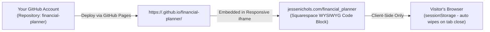

# Squarespace & GitHub Pages Hosting Guide: Financial Planner Demo

This guide walks you through hosting the standalone, anonymized **Financial Planner** interactive simulator on GitHub Pages and embedding it seamlessly into your personal website at `jessenichols.com/financial_planner`.

---

## Architecture Overview



- **Zero-Backend & 100% Client-Side**: No servers, no databases, zero external tracking or data transmission.
- **Strict Privacy**: Defaults to a generic age-30 starter profile ($105k salary, $65k expenses, $115k net worth).
- **Transient Memory**: All visitor customizations are saved in `sessionStorage` and destroyed the moment they close the browser tab.

---

## Step 1: Create a GitHub Repository & Push the Demo Files

You can publish the contents of the `demo/` folder as a dedicated public repository on your GitHub account.

### Option A: Using the GitHub CLI (`gh`) or Web Interface
1. Go to [github.com/new](https://github.com/new).
2. Name the repository: `financial-planner` (or `financial-planner-demo`).
3. Set visibility to **Public** (required for free GitHub Pages).
4. Do not initialize with README, .gitignore, or license (we will push the existing files directly).
5. Open your terminal and run the following commands from your project root:

```bash
# 1. Create a clean standalone Git directory for the demo
cd "/Users/jessenichols/Documents/Antigravity/Financial Modelling/demo"
git init
git add .
git commit -m "feat: initial release of Financial Planner demo edition"

# 2. Rename branch to main
git branch -M main

# 3. Add your GitHub remote and push (replace YOUR_GITHUB_USERNAME)
git remote add origin https://github.com/YOUR_GITHUB_USERNAME/financial-planner.git
git push -u origin main
```

---

## Step 2: Enable GitHub Pages

1. In your GitHub repository, navigate to **Settings** > **Pages** (in the left sidebar).
2. Under **Build and deployment**:
   - **Source**: Select `Deploy from a branch`.
   - **Branch**: Select `main` and folder `/ (root)`.
3. Click **Save**.
4. Within 1–2 minutes, GitHub will generate your live public URL:
   `https://<YOUR_GITHUB_USERNAME>.github.io/financial-planner/`
5. Click the link to test and confirm the application loads cleanly in your browser.

---

## Step 3: Embed in Squarespace (jessenichols.com)

Squarespace allows you to embed custom interactive web tools via a **Code Block** or **Embed Block**.

### 1. Create the Page in Squarespace
1. Log in to your Squarespace account and open your site editor.
2. In the left panel, click **Pages**.
3. Under **Main Navigation** (or **Not Linked** if you only want to share via direct link), click the **+** icon and select **Blank Page**.
4. Name the page: **Financial Planner**.
5. Click the **Gear Icon (⚙️)** next to the page name to open Page Settings:
   - **Page Title**: `Financial Planner`
   - **Navigation Title**: `Financial Planner`
   - **URL Slug**: `/financial_planner` (This ensures the URL is `jessenichols.com/financial_planner`)
   - Click **Save**.

### 2. Add the Interactive Embed Code
1. On the new page, click **Edit** (top left).
2. Click **Add Section** and select **Add a Blank Section**.
3. Click **Add Block** and select **Code** (preferred) or **Embed**.
   *(Note: The Code block is available on Squarespace Business and Commerce plans. If on a Personal plan, use the Embed Block with code snippet).*
4. Set the block width to span the desired width (or full page width).
5. Double-click the Code block to open the editor and paste the snippet below:

```html
<!-- Financial Planner Interactive Embed Container -->
<div class="fp-embed-wrapper" style="position: relative; width: 100%; min-height: 920px; height: 92vh; margin: 0 auto; overflow: hidden; border-radius: 14px; box-shadow: 0 20px 40px -15px rgba(0, 0, 0, 0.4); border: 1px solid rgba(255, 255, 255, 0.1); background-color: #020617;">
  <iframe 
    src="https://jessenicholsfromsanfrancisco.github.io/financial-planner/v4/" 
    style="position: absolute; top: 0; left: 0; width: 100%; height: 100%; border: none;"
    title="Financial Planner & Wealth Simulator"
    allow="clipboard-write"
    loading="lazy">
  </iframe>
</div>

<!-- Optional responsive styling tweak for mobile screens -->
<style>
  @media (max-width: 768px) {
    .fp-embed-wrapper {
      height: 90vh !important;
      min-height: 700px !important;
      border-radius: 8px !important;
    }
  }
</style>
```

> **IMPORTANT**: Make sure to replace `YOUR_GITHUB_USERNAME` in the `src` attribute with your actual GitHub username!

6. Click **Save** and **Publish** the page in Squarespace.

---

## Step 4: Verification & Quality Checklist

Before sharing the link with prospective employers:
- [ ] **Direct URL**: Navigate to `https://jessenichols.com/financial_planner` in an Incognito / Private window.
- [ ] **No Personal Data**: Confirm initial net worth is **$115,000**, gross salary is **$105,000**, and target retirement age is **60.0**.
- [ ] **No "FIRE" References**: Confirm all titles, cards, and export buttons read "Financial Planner", "Retirement", or "Financial Independence".
- [ ] **Session Auto-Wipe**: Adjust a slider or change an expense, refresh the page (persists within session), close the tab, open a new tab to `jessenichols.com/financial_planner` and confirm it reset back to the $115k default.
- [ ] **CSV Archive Export**: Click "Export Forecast Archive (CSV)" in the top header and verify the downloaded file is named `Financial_Forecast_Archive_...csv` and opens cleanly in Excel or Google Sheets.
